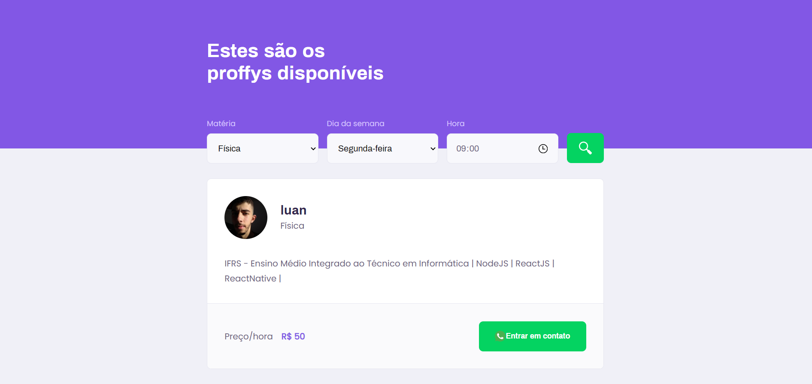

<p  align="center">
  
</p>

<p  align="center">
  <a  href="https://www.linkedin.com/in/luan-souza-6b07b1171/">
    
  </a>

  

  <a  href="https://github.com/RafaelGoulartB/proffy/commits/master">
    
  </a>

  

  <a  href="https://github.com/RafaelGoulartB/proffy/stargazers">
    
  </a>
</p>

# :pushpin: Sumary

* [Introduction](#paperclip-introduction)
* [Features](#clipboard-features)
* [Screenshots](#camera-screenshots)
* [Technologies](#computer-technologies)
* [How to Run](#rocket-how-to-run)
* [Bugs and Issues](#bug-bugs-and-issues)
* [Contributing](#man_mechanic-contributing)
* [License](#books-license)

# :paperclip: Introduction

This project has the primary objective to connect teachers and students. 
The idea and implementation has made in Next Level Week 2 by [Rocketseat](https://github.com/Rocketseat)

# :clipboard: Features

* Register of people that want to teach some subject
* Listing teachers with filters to subjects, week days and hours of the day
* See more of teacher's profile
* Enable whatsapp contacting

# :camera: Screenshots

## Web Screenshots
<div>
  
  
</div>

## Mobile App Screenshots
<div>
  
  
</div>

# :computer: Technologies

* [Node.js](https://nodejs.org/en/)
* [Typescript](https://www.typescriptlang.org/)
* [React](https://reactjs.org/)
* [React Native](https://reactnative.dev/)
* [Express](https://expressjs.com/)
* [SQLite](https://www.sqlite.org/index.html)
* [Knex](http://knexjs.org/)
* [Axios](https://github.com/axios/axios)

# :rocket: How to Run

```bash
# Clone Repository
$ git clone https://github.com/LuanSilveiraSouza/nlw2-proffy.git
```
### Run Backend

```bash
# Go to server folder
$ cd nlw2-proffy/server

# Install Packages
$ yarn install

# Run Application
$ yarn start
```
Access API at http://localhost:3333/

### Run Web App

```bash
# Go to web folder
$ cd nlw2-proffy/web

# Install Packages
$ yarn install

# Run Application
$ yarn start
```
Access http://localhost:3000/ to see the website.

### Run Mobile Project
To run the mobile project you need a cellphone with the app of [expo](https://play.google.com/store/apps/details?id=host.exp.exponent) instaled or a emulator android/ios in your computer.
<br />

```bash
# Go to mobile folder
$ cd nlw2-proffy/mobile

# Install Packages
$ yarn install

# Run Application
$ yarn start
```
After start, you can access Expo Developer Tools in http://localhost:19002/.
To run the app, read the QRCode with expo app in physical device or run on emulator.

# :bug: Bugs and Issues

Feel free to open new issues and colaborate with others issues in [Proffy Issues](https://github.com/LuanSilveiraSouza/nlw2-proffy/issues).

# :man_mechanic: Contributing

There are many forms to contribute with the project, first of all you can give this github repo a Star.

If you want do help with the code follow the steps bellow

```bash
# Fork this Repository https://github.com/LuanSilveiraSouza/nlw2-proffy

# Clone your fork
$ git clone {your-fork-url}
$ cd proffy

# Create a branch with your feature
$ git checkout -b {branch-name}

# Make the commit with your changes
$ git commit -m 'Feat: {feature-name}'

# Send the code to your remote branch
$ git push origin {branch-name}
```
Then send a Pull Request that will be analyzed and approved if it helps with the project

# :books: License

Released in 2020 under [MIT License](https://opensource.org/licenses/MIT)

Made with :heart: by Luan Souza.
